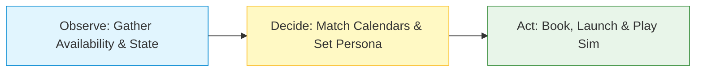

# Product Requirements Document: Digi-Child Clinical Orchestrator
**Build name**: Digi-Child Clinical Orchestrator (Therapeutic & Logistics Edition)  
**Owner**: Naquan, Mitra, Jimmy  
**Date**: July 7, 2026  

---

## 1. PROBLEM
Clinicians and parents in court-ordered programs experience significant delays and administrative overhead when coordinating mandatory behavioral evaluation sessions, because aligning the erratic schedules of an external parent, a licensed clinician, and a court-appointed monitor creates an extensive "scheduling Tetris" bottleneck. This results in 10–15 hours of staff time wasted per week on logistics rather than active therapy, while delaying critical, risk-free behavioral practice for parents who need to learn to de-escalate real-world child defiance safely.

### Supporting Context
* Manual calendar coordination for multi-person panel reviews routinely drains 10–15 hours a week for administrative and clinical teams.
* Individuals undergoing court-ordered parenting education lack dynamic, real-time feedback loops to practice conflict resolution safely, often compromising long-term parent-child relationship outcomes.
* No existing platform bridges autonomous multi-party calendar orchestration with localized, state-tracked clinical simulation tools.

### 1a. Opportunity
Enable therapeutic networks to completely automate multi-party panel scheduling and immediate digital simulation provisioning, eliminating administrative friction entirely while delivering a standardized, risk-free environment for behavioral evaluation.

### Market Opportunity
* Repetitive, high-volume coordination workflows consume substantial operational budgets within court-ordered and therapeutic care networks.
* This platform provides a secure, clinical-grade digital architecture that replaces passive, lecture-based learning with trackable, behavioral metrics.

### 1b. Users & Needs
* **Primary users**: Parents/Caregivers in court-ordered programs or therapeutic settings who require high-fidelity, hands-on de-escalation practice.
* **Secondary users**: Clinicians, social workers, and court-appointed monitors who assess patient progress and manage session logistics.

### Key User Needs
* **As a parent**, I need a simulation that feels unpredictable and challenging so I can practice responding to genuine behavioral friction rather than theoretical questions.
* **As a clinician**, I need data on user input and system response so I can objectively evaluate a patient's progress toward healthy parenting benchmarks.
* **As a clinician**, I need the system to automatically handle session booking and simulation environment setup so I can focus entirely on behavioral evaluation instead of manual calendar logistics.

---

## 2. PROPOSED SOLUTION
Digi-Child Clinical Orchestrator is an AI-native coordination and simulation platform that completely automates multi-party scheduling and provisions controlled digital therapeutic environments. Users simply input or confirm their availability via an automated outreach link, and the system autonomously matches calendars across multiple internal and external parties to book the session. The moment the session is confirmed, the system instantiates the parenting simulation, pre-loading the parent’s historical behavioral data. As a result, clinical teams eliminate the tedious administrative back-and-forth entirely while parents gain seamless access to critical, metric-tracked conflict resolution training.

### 2a. Value Proposition
Clinicians and court-ordered parents who struggle with manual scheduling bottlenecks and abstract classroom lessons use Digi-Child Orchestrator, an integrated scheduling and simulation platform, to autonomously book panel reviews and launch high-fidelity behavioral exercises. Unlike traditional passive lectures or manual calendar coordination, it seamlessly bridges logistical automation with real-time, metric-tracked conflict resolution, helping clinical programs save over 10 hours a week while capturing objective data on patient progress.

### 2b. Top 3 MVP Value Props
1. **The Vitamin (must-have baseline)**: A clinical baseline that mimics standard child developmental phases for consistent evaluation.
2. **The Painkiller (solves the core pain)**: Complete automation of the multi-person panel scheduling bottleneck by autonomously cross-referencing external candidate availability with internal interviewer calendars.
3. **The Steroid (the magic moment)**: Automatic provisioning of the live simulation environment pre-loaded with the parent's historical `state.json` data the exact moment the panel session begins.

### 2c. Goals & Non-Goals
* **Goals**:
  * Provide an automated, self-serve calendar coordination engine for complex multi-party panel scheduling.
  * Track quantifiable metrics (e.g., `trust_level`, `temperament`, `consecutive_mistreatments`) within a centralized data structure for objective assessment.
  * Ensure a secure, controlled simulation environment for behavioral practice in therapeutic and court-ordered contexts.
* **Non-Goals**:
  * Public release or consumer-facing commercial distribution (strictly preserved for prescribed/clinical use).
  * Replacing licensed human oversight; the system acts purely as an administrative and data-tracking support tool, not an automated diagnostic judge.

### 2d. Success Metrics
* **Operational Efficiency**: Time-to-schedule a mandatory multi-person panel session $< 24$ hours from initial intake referral.
* **Staff Time Reclaimed**: Reduction of 80% (saving 10+ hours/week) spent by staff on manual scheduling.
* **De-escalation Proficiency**: Increasing trend of child `trust_level` across 5 consecutive sessions.
* **Behavioral Consistency**: Decreasing trend of `consecutive_mistreatments` frequency per patient portfolio.

---

## 3. REQUIREMENTS & TEMPERAMENT SCHEMA

### 3a. Child Temperament & Personality Profiles
The simulator instantiates three customized developmental profiles based on attachment theory and behavioral diagnostics:

1. **Cooperative (Secure Pattern)**:
   * *Initial Metrics*: Trust: 80, Volatility: 10, Temperament: `secure`.
   * *Description*: Calm, receptive to boundaries, and conversational. Shows resilience to minor parenting missteps but requires active validation to maintain high trust.
2. **Oppositional (Volatile Plan B Pattern)**:
   * *Initial Metrics*: Trust: 40, Volatility: 75, Temperament: `transgressed`.
   * *Description*: Highly resistant and defensive. Rooted in Ross Greene's "Explosive Child" framework—defiance is triggered by lagging cognitive flexibility. Responds to direct commands with verbal spikes; requires structured collaboration ("Plan B") to pacify.
3. **Withdrawn (Avoidant Passive Pattern)**:
   * *Initial Metrics*: Trust: 30, Volatility: 25, Temperament: `neutral`.
   * *Description*: Passive-aggressive silence and disengagement. Rooted in avoidant attachment theory. Unresponsive to interrogation; requires high safety/nurturing cues to open up.

### 3b. Age-Specific Defiance Scenarios
Defiant behavioral triggers activate dynamically after **3 conversational turns** based on the setting and the age band:
* **Toddler (Age 5–7) + Living Room**: Child scribbles on the wall with crayons.
* **Toddler (Age 5–7) + Public Park**: Child stands up dangerously on the swings, ignoring warning boundaries.
* **Teenager (Age 14–16) + Car Cabin**: Child pulls out phone, disengages completely, and refuses to talk.

### 3c. User Journeys
* **User Journey 1: Parent practicing behavioral management**:
  * **[P0]** User can input verbal or written responses to the child agent.
  * **[P0]** System must process the input and update `trust_level` in the database.
  * **[P0]** User can observe the child agent's reaction in the UI.
  * **[P1]** User can pause the simulation if immediate instruction or clinical intervention is required by the live observer.

* **User Journey 2: Clinician evaluating progress and managing logistics**:
  * **[P0]** System must autonomously cross-reference availability to book panel evaluation sessions.
  * **[P0]** Upon session confirmation, the system must automatically spin up the simulation UI and instantiate the parent's current history.
  * **[P0]** System must record every instance of `consecutive_mistreatments` for clinical review.
  * **[P0]** System must display an accurate history of the child-parent interaction via the history log.

---

## 4. TECHNICAL SPECIFICATIONS & SCHEMAS

### 4.1 Database Schemas (SQLite)

#### Table: `sessions`
Tracks logistical metadata and live session state.
```sql
CREATE TABLE sessions (
    session_id TEXT PRIMARY KEY,
    parent_id TEXT NOT NULL,
    clinician_id TEXT NOT NULL,
    monitor_id TEXT NOT NULL,
    status TEXT NOT NULL CHECK(status IN ('pending', 'booked', 'live', 'completed', 'paused')),
    scheduled_time TEXT,
    child_age INTEGER DEFAULT 5,
    temperament_profile TEXT DEFAULT 'cooperative',
    trust INTEGER DEFAULT 50,
    volatility INTEGER DEFAULT 50,
    security INTEGER DEFAULT 50,
    curiosity INTEGER DEFAULT 50,
    autonomy INTEGER DEFAULT 50,
    logic INTEGER DEFAULT 50,
    consecutive_mistreatments INTEGER DEFAULT 0
);
```

#### Table: `interaction_history`
Tracks the chronological conversation stream and clinical audits.
```sql
CREATE TABLE interaction_history (
    id INTEGER PRIMARY KEY AUTOINCREMENT,
    session_id TEXT NOT NULL,
    speaker TEXT NOT NULL CHECK(speaker IN ('parent', 'child', 'system')),
    message TEXT NOT NULL,
    timestamp DATETIME DEFAULT CURRENT_TIMESTAMP,
    metrics_snapshot TEXT, -- JSON string storing Trust, Volatility, etc. at this turn
    FOREIGN KEY(session_id) REFERENCES sessions(session_id)
);
```

### 4.2 System API Endpoints

| Method | Endpoint | Description | Payloads / Returns |
| :--- | :--- | :--- | :--- |
| **POST** | `/api/schedule/create` | Generates outreach booking link | **Input**: IDs, availability calendars<br>**Return**: `sessionId` |
| **POST** | `/api/schedule/book` | Confirms parent slot, sets simulator live | **Input**: `sessionId`, selected slot<br>**Return**: Booking details |
| **GET** | `/api/session/status` | Polled by UI to sync pause/resume states | **Return**: Current status, active metrics |
| **POST** | `/api/chat` | Sends parent text to simulator | **Input**: text, location<br>**Return**: Child reaction & mood |
| **POST** | `/api/session/control` | Clinician overrides simulation state | **Input**: action (`pause` / `resume` / `complete`) |
| **GET** | `/api/session/report` | Pulls compiled clinical session report | **Return**: Session metadata, logs, metrics |

---

## 5. AGENTIC ALIGNMENT AUDIT (SATURDAY PRESENTATION PREP)

This section details how the platform aligns with the L2L Agentic Presentation framework.

### 5.1 Role & Pain Point
* **Role**: Customer-Success style scheduling and digital therapeutic orchestrator for clinic networks.
* **Core Pain Point**: High staff time overhead (10–15 hours/week) spent matching human interviewer panels manually.
* **Agent Impact**: Instantly maps parent slots with clinician/monitor availability, provisions the simulation sandbox, and begins capturing metric data.

### 5.2 Observe-Decide-Act (ODA) Core Loop

* **Observe**: Retrieves calendar slots (clinician, monitor, parent), state metrics (Trust, Volatility, Security), and live transcript arrays.
* **Decide**: Evaluates calendar overlaps to output a matching time slot; calculates the next-state parameters for Mira using live Claude API reasoning.
* **Act**: Books the session, instantiates the sandbox simulation URL, triggers alert warnings, and downloads clinical reports.

### 5.3 Blast Radius & Human-in-the-Loop Checkpoint
* **Blast Radius Analysis**:
  * *Low-Risk / Reversible*: Scheduling matches are highly reversible (can be rescheduled).
  * *High-Risk / Irreversible*: Subjecting the parent to extreme child defiance scenarios without clinician monitoring, or allowing consecutive abusive dialog patterns to accumulate without therapist feedback.
* **Human-in-the-Loop Checkpoint**:
  * *The Checkpoint*: A live **Pause Simulation** toggle.
  * *Trigger*: When a therapist determines verbal intervention is required or if the patient triggers $\ge 2$ consecutive mistreatments.
  * *Action*: Halts simulation inputs, locks the viewport with a blurred glassmorphic overlay, and stops database updates until manually resumed by the clinician.

### 5.4 Live Demo Plan
* **Input**: An scheduled Oppositional profile session (Initial Trust: 40, Volatility: 75).
* **Expected Output**: 
  1. Clinician generates outreach; booking page opens in new tab.
  2. Booking match launches simulator.
  3. Parent receives de-escalation cautions (audio beep, viewport glow, caution banner) on wall-crayons conflict event (turn 3).
  4. Clinician pauses, intervenes, completes, and downloads the session report.
* **Backup**: Seeded mock session JSON database files and pre-recorded UI flow demonstration video.
