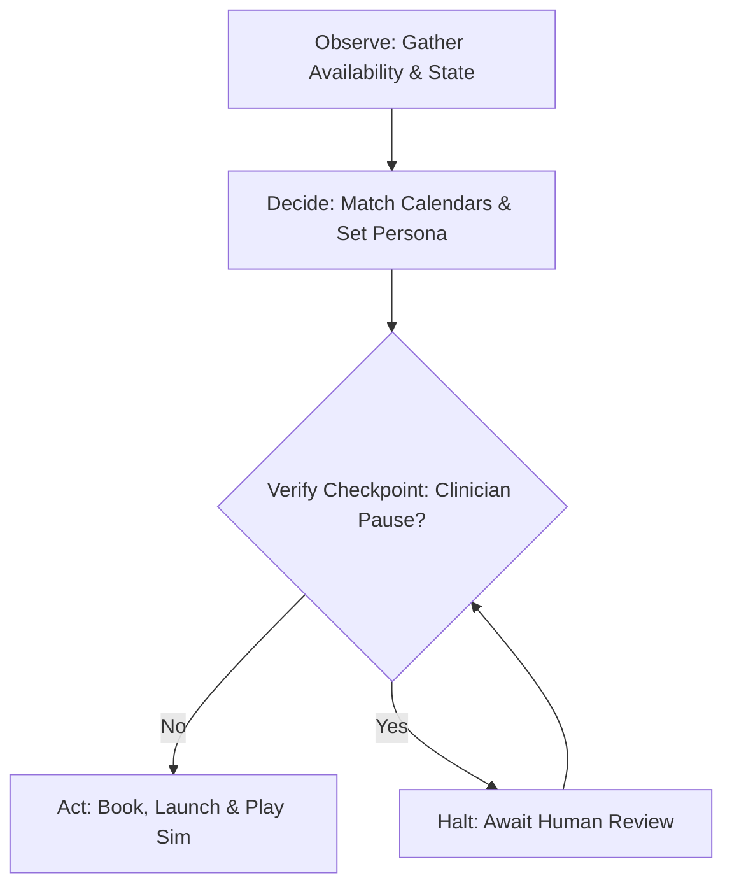

# Product Requirements Document: Digi-Child Clinical Orchestrator

## Build Name
Digi-Child Clinical Orchestrator (Therapeutic & Logistics Edition)

## Owners
Naquan, Mitra, Jimmy

## Date
July 8, 2026

---

## 1. Role & Pain Point

### Role
An AI-native clinical coordinator and real-time behavioral simulation agent serving clinical teams, social workers, and court-ordered parents.

### Pain Point
Manual calendar coordination for multi-person evaluation panels (parent, clinician, and court-appointed monitor) routinely consumes 10–15 hours per week of manual coordination. This "scheduling Tetris" bottleneck delays critical, risk-free behavioral practice for parents who need to learn how to safely de-escalate defiance.

### Opportunity
Automate multi-party scheduling, instantiate simulation environments pre-loaded with historical parent state data, and provide objective behavioral metric tracking—saving clinical staff time while capturing clear attachment and trust data.

---

## 2. Observe-Decide-Act (ODA) Loop & Checkpoint

The Orchestrator operates on a continuous ODA loop with integrated safety overrides.

### 2.1 Observe
* **Inputs gathered**:
  * Clinician and Court Monitor availability calendars.
  * Parent calendar submissions via automated outreach.
  * Parent's historical behavioral metrics (`state.json` history including Trust, Volatility, Security, and consecutive mistreatments).
  * Live conversation inputs from the parent participant.

### 2.2 Decide
* **Matching logic**:
  * Cross-references clinician, monitor, and parent slots to locate overlapping blocks.
  * Selects corresponding child temperament profile rules (Cooperative, Oppositional, or Withdrawn) and age-typical defiant scenarios.
  * Analyzes parent speech input to calculate next-turn metrics (adjusting Trust/Volatility) and determining the timing of de-escalation conflict events.

### 2.3 Act
* **Actions executed**:
  * Registers booking, updates state database, and launches simulation link.
  * Renders child dialog and triggers interactive alerts (visual viewport flash, banner, synthetic audio beeps).
  * Compiles post-session clinical audits for download.

### 2.4 Blast Radius Assessment & Checkpoint

#### Blast Radius Evaluation
1. **Low-Risk/Reversible Decisions**: Scheduling a panel slot is reversible and low-cost to adjust.
2. **High-Risk/Irreversible Decisions**: Allowing a highly volatile simulation to run without supervision while a parent exhibits high-friction/abusive dialogue patterns.

#### Highest-Risk Action
Triggering extreme behavioral scenarios or allowing consecutive parent mistreatments to accumulate without clinician intervention, which could reinforce negative parenting loops or lead to invalid clinical evaluations.

#### Human-in-the-Loop Checkpoint
* **Pause Simulation Checkpoint**: A real-time clinician dashboard override.
* **Trigger**: If a parent reaches $\ge 2$ consecutive mistreatments, or if a clinician spots behavior requiring immediate instruction, the clinician clicks the **Pause** button on the control hub.
* **Effect**: The parent's screen freezes with a blurred glassmorphic overlay, disabling input. The system stops processing state updates until the clinician conducts a manual review and clicks **Resume**.

---

## 3. Live Demo Plan

### 3.1 Input
* Seeded clinician and monitor calendars with open slots.
* A parent profile setup with **Oppositional** temperament (Initial Trust: 40, Volatility: 75, Temperament: `transgressed`).

### 3.2 Expected Outcome
1. Clinician generates outreach link, opening the scheduling booking screen in a new tab.
2. Parent books overlapping slot. The system provisions the simulation immediately.
3. On the 3rd exchange in the living room, the Oppositional child triggers a defiant event (scribbling on the wall).
4. Viewport frame borders pulse red, caution audio beeps, and advice banner guides the parent.
5. Clinician pauses the simulation to intervene, resumes it, completes the session, and downloads the text clinical audit report.

### 3.3 Backup
* Pre-recorded video walkthroughs demonstrating calendar matching, active session, and report retrieval.
* Seeded local backup session files to showcase final session reports.

---

## 4. Requirements & Specifications

### 4.1 Parent Simulator Interface (P0)
* **Written Input**: Must support natural parent dialog box submission.
* **Child Dialog**: Displayed as a responsive, frosted card overlay with light text contrast.
* **Feedback cues**: Pulses warning frame, displays caution banner, and plays synthetic beep audio on de-escalation triggers.

### 4.2 Clinician Dashboard (P0)
* **Logistics matching**: Auto-detects overlap across 3 parties and updates slot status.
* **Simulation overrides**: Live Pause/Resume toggle buttons that freeze/unfreeze simulation input instantly.
* **Report generation**: Endpoint that extracts session metadata and dialog to generate a downloadable clinical report.

### 4.3 Data Privacy & Ethics (P1)
* Session history must be stored locally in an encrypted SQLite database.
* All defiants/triggers must remain strictly calibrated to age-appropriate behaviors (e.g. toddler crayons, teen disengagement).
